Route Options
=============

The router has some options to ease routing. Both connectivity routes
and directed routes have options. Options are separated by a comma.

Sort options
^^^^^^^^^^^^

These options specify which rectangle to route from. They are useful for
connectivity route where the start rectangles are not specified.

onTopB
''''''

Put the bottom rectangle as start rectangle

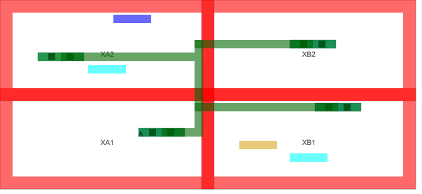

onTopT
''''''

Put the top rectangle as
start rectangle

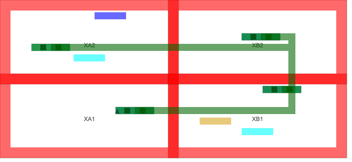

onTopR
'''''''

Put the
right rectangle as start rectangle

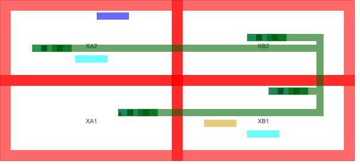

onTopL
''''''''

Put the left rectangle as start rectangle

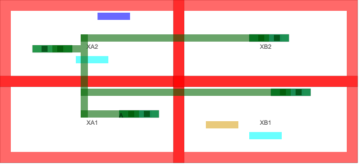

Offset
^^^^^^

These options can offset the routing rectangle to avoid nearby routings

offsethigh
''''''''''

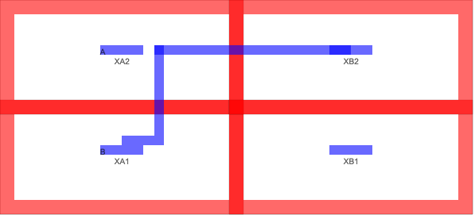

offsetlow
''''''''''

.. image:: ../graphics/Options_offsetlow.png

offsethighend
''''''''''''''''''''

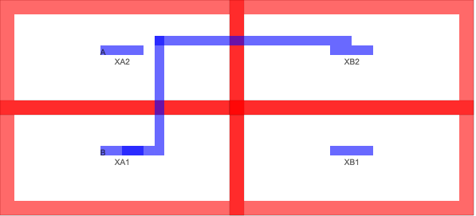

offsetlowend
''''''''''''''''''''

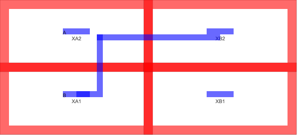

Track
^^^^^

‘track’ can be used to specifiy how many grids the route is offset. It
uses “ROUTE” and “horizontalgrid”.

For example ‘track4’, gives

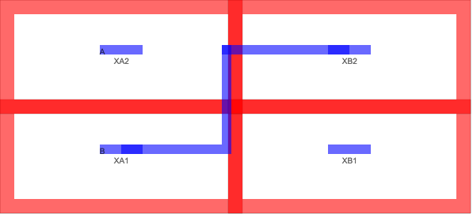

For example ‘track8’, gives

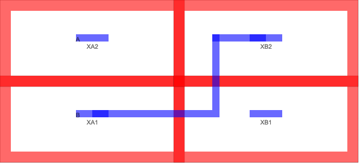

Cuts
^^^^

The number of cuts used by the route can be modified. Default is two
cuts for the horizontal via.

.. _cuts-1:

\\d+cuts
''''''''''''''''''''''

For example ‘3cuts’

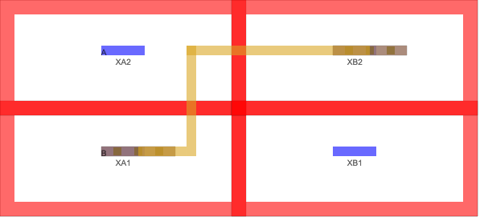

And for example ‘5cuts’

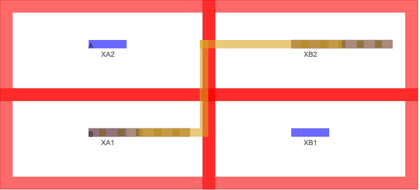
