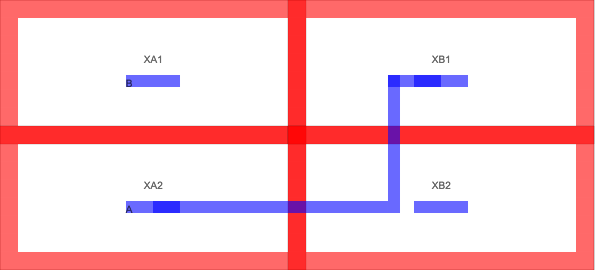
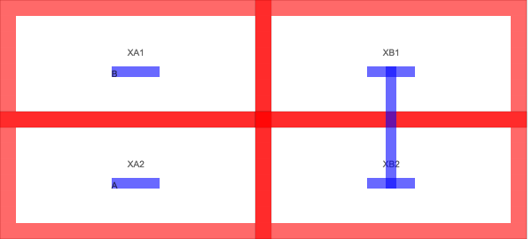

Route Type
===========

The following route types can be used, all of them have a short-hand
notation.

Left (-\|--)
^^^^^^^^^^^^^

The ‘Left’ route will go one metal space to the left, then up, and or
down, and finish the route. The type of route will depend on whether the
start rectangle is to the left, or the right of the finish.

Starting from the left

.. code:: json

   { "name" : "Directed_StartLeft_Left(-|--)",
     "inherit": "TEST",
     "beforeRoute": [
       {"addDirectedRoutes" : [["M1","S","XA1:S-|--XB2:S"]]}
     ]
   }

.. image:: ../graphics/StartLeft_Left.png

Starting from the right

.. code:: json

   { "name" : "Directed_StartRight_Left(-|--)",
     "inherit": "TEST",
     "beforeRoute": [
       {"addDirectedRoutes" : [["M1","S","XB1:S-|--XA2:S"]]}
     ]
   }

.. image:: ../graphics/StartRight_Left.png

Right (--\|-)
^^^^^^^^^^^^^^

The ‘Right’ route will go one metal spacing to the right, then up, and
or down, and finish the route.

Starting from the left

.. code:: json

   { "name" : "Directed_StartLeft_Right(--|-)",
     "inherit": "TEST",
     "beforeRoute": [
       {"addDirectedRoutes" : [["M1","S","XB1:S--|-XB2:S"]]}
     ]
   }

.. image:: ../graphics/StartLeft_Right.png

.. code:: json

   { "name" : "Directed_StartRight_Right(--|-)",
     "inherit": "TEST",
     "beforeRoute": [
       {"addDirectedRoutes" : [["M1","S","XB1:S--|-XA2:S"]]}
     ]
   }

U left route (\|-)
^^^^^^^^^^^^^^^^^^

The U route will go one metal spacing left, up or down, and back again.

.. code:: json

   { "name" : "Directed_U_Left(|-)",
     "inherit": "TEST",
     "beforeRoute": [
       {"addDirectedRoutes" : [["M1","S","XB1:S|-XB2:S"]]}
     ]
   }       

.. image:: ../graphics/U_Left.png

U right route (-\|)
^^^^^^^^^^^^^^^^^^^^

The U route will go one metal spacing right, up or down, and back again.

.. code:: json

   { "name" : "Directed_U_Right(-|)",
     "inherit": "TEST",
     "beforeRoute": [
       {"addDirectedRoutes" : [["M1","S","XB1:S-|XB2:S"]]}
     ]
   }

.. image:: ../graphics/U_Right.png

Vertical route (||)
^^^^^^^^^^^^^^^^^^^

The vertical route will find the center of the start rectangles and draw
a straight vertical line up, or down to the stop rectangles.

.. code:: json

   { "name" : "Directed_Vertical(||)",
     "inherit": "TEST",
     "beforeRoute": [
        {"addDirectedRoutes" : [["M1","S","XB1:S||XB2:S"]]}
     ]
   }

